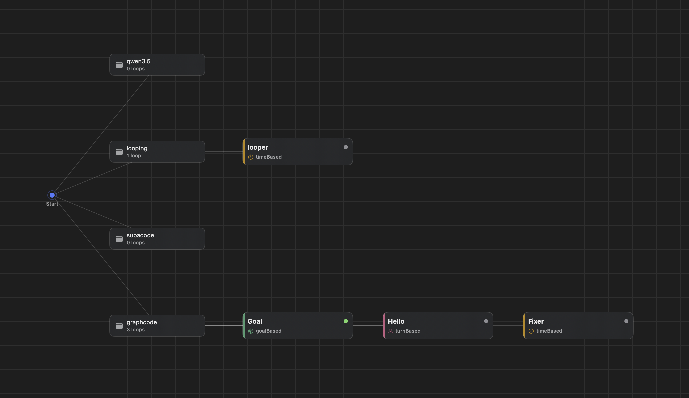

# GraphCode

*Graphs of live, steerable Claude Code sessions on macOS.*

[](https://github.com/scgopi/GraphCode/releases)
-blue)
[](LICENSE)

You can run one Claude Code session in a terminal. GraphCode lets you run ten —
connected, unattended, and still yours to attach to and correct mid-run. Each node in the
graph is a unit of work running inside a real CLI coding-agent session; each edge is a
hand-off, message, or spawn between them. The sessions are real terminals you can attach
to, watch, and steer — not headless jobs that report back when they're done.

> Early and moving. Expect rough edges, and see [Known limitations](#known-limitations).

## How it works

Every loop type is "an agent runs repeatedly" — they differ in what *you* stop doing:

| Loop type | You hand off | Runs until | For example |
|---|---|---|---|
| **Turn-based** | the check | you end it — each turn pauses for your review inside the session | a refactor you want to eyeball step by step |
| **Goal-based** | the stop condition | a goal is met (optionally a shell predicate exits 0) | "fix the build" — done when `make test` passes |
| **Time-based** | the trigger | you stop it — cadence lives in the prompt (`/loop 1h …`) | hourly issue triage |
| **Proactive** | the prompt | a composite sub-graph runs it end to end | a pipeline that plans its own steps |

Two design choices explain most of the rest:

- **GraphCode schedules nothing.** A time-based loop's recurrence lives *inside* its
  session, written into the prompt with the agent's own `/loop` or `/schedule` skill. The
  daemon only makes sure the session is alive. That's what keeps a running loop something
  you can attach to and correct, rather than a job that already finished somewhere.
- **Sessions outlive everything.** Each loop's terminal is a [`zmx`](https://zmx.sh)
  session, so it survives closing the window, quitting the app, and restarting the daemon —
  reattaching restores full scrollback.

So a working graph might look like: a time-based loop runs `/loop 1h Triage new bug
reports`, a hand-off edge fires a goal-based fixer loop for anything it finds (done when
the test suite passes), and a second edge hands the fix to a turn-based reviewer loop where
you approve each change yourself. All three are live terminals the whole time — click any
node and you're in that session, scrollback and all.



Every project you add hangs off **Start**, and each carries its own graph — here the
`graphcode` project chains three loops of different types, each color-coded by kind.

## Install

Requires **macOS 15+ on Apple Silicon** (arm64), with **Claude Code on your `PATH`** —
GraphCode launches it, it doesn't bundle it.

Download the `.dmg` from [Releases](https://github.com/scgopi/GraphCode/releases), open it,
and drag **GraphCode** to Applications. That's the whole install — releases are Developer
ID signed and notarized, so a browser download opens on a double-click.

The app carries `graphcoded`, `graphcode` (the CLI), and `zmx` inside it, and puts them in
`~/.graphcode/bin` on first launch, along with the launchd agent that keeps the daemon
running. Add that directory to your `PATH` for the CLI.

<details>
<summary>Holding a pre-0.0.9 build?</summary>

Builds before 0.0.9 were ad-hoc signed and picked up a quarantine flag that made macOS
refuse them with a misleading *"graphcode.app is damaged"*.
`xattr -dr com.apple.quarantine /Applications/graphcode.app` clears it — or just grab the
current release.

</details>

## Using it

1. **Add a folder** — the sidebar's ⊕ menu. It becomes a project with its own graph. Whatever
   was open is restored next launch; right-click a project to Close, Remove, or delete its
   loops.
2. **Create a loop** — ⊕ on the canvas. Pick a type; the form changes to match. For a
   time-based loop put the cadence in the prompt itself: `/loop 1h Check for new reports`.
3. **Open it** — click the node. You get its terminal workspace: tabs (⌘T), splits (⌘D /
   ⌘⇧D), and ⌘1–9 to switch. Every loop type opens the same way, including ones the daemon
   started on its own — you're attaching to the live session, not a copy of its output.
4. **Connect loops** — drag between nodes. An edge is a hand-off by default (fires when the
   source resolves); it can also be a message or a spawn, with a condition and a cycle guard.

A turn-based loop resolves when its session exits — the per-turn review happens inside the
session itself, so there's no separate approve step in the app.

## Parts

| Piece | What it is |
|---|---|
| `graphcode.app` | The UI — project sidebar, graph canvas, and a per-loop terminal workspace with tabs and splits |
| `graphcoded` | Background daemon (launchd agent). Owns every project's graph, fires hand-off edges, polls goal predicates, and keeps unattended sessions alive whether or not the app is open |
| `graphcode` | CLI for the same daemon — `graphcode status <project>`, `graphcode node create …` |
| `zmx` | Third-party session daemon that keeps each loop's PTY alive ([zmx.sh](https://zmx.sh)) |
| GhosttyKit | Third-party terminal engine rendering each surface ([ghostty.org](https://ghostty.org)) |

State lives in `~/.graphcode/` — per-project graphs, recents, terminal layouts, the daemon
socket and logs, and the installed binaries. **Nothing is ever written inside a project
folder you open.**

## Building from source

Needs [mise](https://mise.jdx.dev) (Xcode, tuist, swiftlint, zig come through it) and the
submodules:

```sh
git submodule update --init --recursive
make doctor          # checks every prerequisite and prints the fix for anything missing
make third-party     # builds zmx and GhosttyKit (zig)
make install-zmx install-cli daemon-install
make run-app
```

`make doctor` is the fastest way to find a missing piece — it checks the toolchain, the
submodules, the macOS 15 SDK zig needs, and the Metal toolchain GhosttyKit compiles shaders
with.

## Development

```sh
make test     # unit tests
make check    # swiftlint + swift-format, both strict
make format   # apply formatting
```

Design docs live in `docs/` and are kept local (gitignored) for now.

## Known limitations

- **Apple Silicon only.** GhosttyKit is built for the native architecture; there is no
  x86_64 slice, so a universal build won't link.
- **Claude Code is the only working backend.** Copilot CLI and Codex exist in the model and
  the picker refuses pairings it can't host, but only Claude Code is wired end to end.
- **A new folder stops at Claude's trust prompt.** An unattended loop started by the daemon
  in a folder Claude hasn't seen waits at *"Do you trust this folder?"* and shows as
  `running` while doing nothing. Attach once and answer it.
- **First session start is slow if your shell profile is slow** (conda's hook, for
  instance) — the queued command runs only after the profile finishes.
- **Sessions aren't reaped.** Long-lived `graphcode-*` zmx sessions accumulate; list them
  with `zmx list` and remove dead ones with `zmx kill`.

## Third-party

Built on [Ghostty](https://ghostty.org) and [zmx](https://zmx.sh) — independent open-source
projects, vendored as submodules under `ThirdParty/`.

## License

[MIT](LICENSE).
