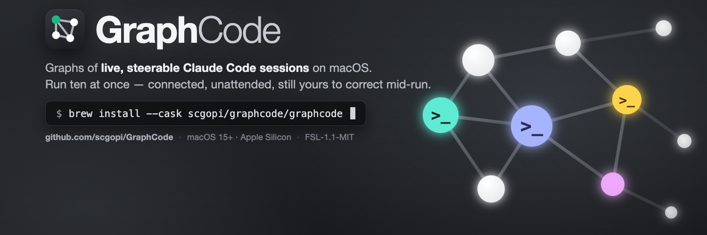
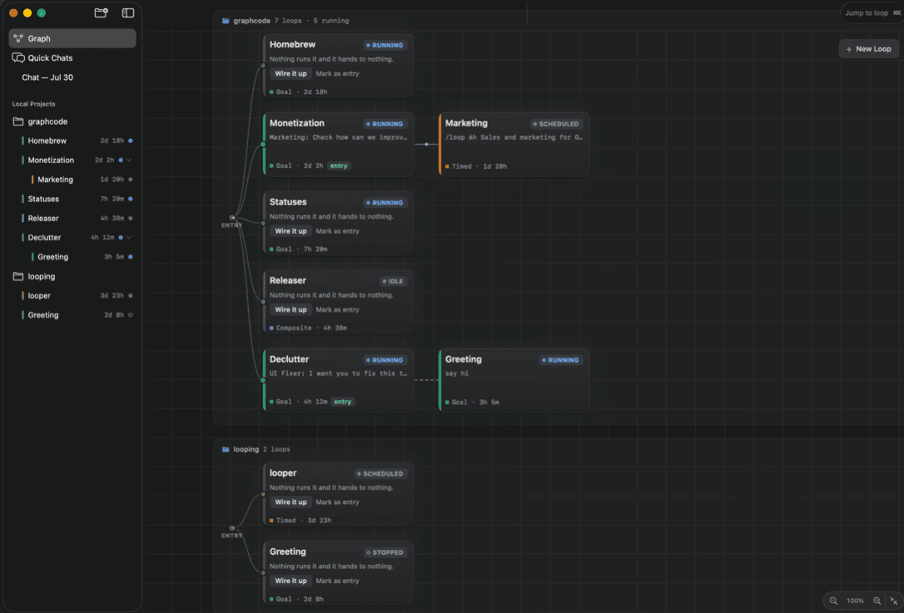

<p align="center"><a href="https://graphcode.app/"></a></p>

<p align="center">
  <a href="https://github.com/scgopi/GraphCode/releases"></a>  <a href="LICENSE"></a>
</p>

<p align="center">
  <a href="https://graphcode.app/">Website</a> · <a href="https://github.com/scgopi/GraphCode/releases/latest/download/graphcode-macos-arm64.dmg">Download .dmg</a> · <a href="https://github.com/scgopi/GraphCode/releases">All releases</a> · <a href="https://graphcode.app/shortcuts.html">Shortcuts</a>
</p>

You can run one Claude Code session in a terminal. GraphCode lets you run ten — connected, unattended, and
still yours to attach to and correct mid-run. Each node is a unit of work inside a real CLI coding-agent
session; each edge is a hand-off, message, or spawn between them. They are live terminals, not headless jobs.

**[Graph Engineering, simplified →](https://graphcode.app/)** — the mental model, then the machinery.



## How it works

Every loop type is "an agent runs repeatedly" — they differ in what *you* stop doing:

| Loop type | You hand off | Runs until | For example |
|---|---|---|---|
| **Turn-based** | the check | you end it — each turn pauses for your review inside the session | a refactor you want to eyeball step by step |
| **Goal-based** | the stop condition | a goal is met (optionally a shell predicate exits 0) | "fix the build" — done when `make test` passes |
| **Time-based** | the trigger | you stop it — cadence lives in the prompt (`/loop 1h …`) | hourly issue triage |
| **Composite** | the prompt | a sub-graph of loops runs it end to end | a pipeline that plans its own steps |

Two design choices explain most of the rest:

- **GraphCode schedules nothing.** A time-based loop's recurrence lives *inside* its session, written into the
  prompt with the agent's own `/loop` skill; the daemon only keeps the session alive. That is what makes a
  running loop something you can attach to and correct, rather than a job that already finished somewhere.
- **Sessions outlive everything.** Each loop's terminal is a [`zmx`](https://zmx.sh) session, so it survives
  quitting the app and rebooting — the backend's session ID is persisted, so relaunching resumes the
  conversation with `--resume` rather than starting a duplicate.

## Install

Requires **macOS 15+ on Apple Silicon** (arm64), with **Claude Code on your `PATH`** — GraphCode launches it,
it doesn't bundle it.

```sh
brew install --cask scgopi/graphcode/graphcode
```

Or drag **GraphCode** to Applications from the [latest `.dmg`](https://github.com/scgopi/GraphCode/releases/latest/download/graphcode-macos-arm64.dmg).
Releases are Developer ID signed and notarized.

## Using it

1. **Add a project** — the sidebar's ⊕ menu: a local folder, a clone from a URL, or a remote repository
   over SSH (key auth and zmx on the server; loops run there while this Mac steers them).
2. **Create a loop** — ⊕ on the canvas. Write the prompt and hit Create; the type chooser explains what
   each kind hands off, and a goal's done check has a **Test** button that runs it as the daemon will.
3. **Open it** — click the node for that loop's terminal workspace: tabs, splits, ⌘K to jump to any loop, ⌘⇧R to walk
   the ones asking for you ([shortcuts](https://graphcode.app/shortcuts.html)). You attach to the live session.
4. **Connect loops** — drag between nodes. An edge is a hand-off by default (fires when the source
   resolves); it can also be a message or a spawn, with a condition and a cycle guard.

## Parts

| Piece | What it is |
|---|---|
| `graphcode.app` | The UI — project sidebar, graph canvas, and a per-loop terminal workspace with tabs and splits |
| `graphcoded` | Background daemon (launchd agent). Owns every project's graph, fires hand-off edges, polls goal predicates, and keeps unattended sessions alive whether or not the app is open |
| `graphcode` | CLI for the same daemon — start with `graphcode projects` and `graphcode --help`; use `status` before retrying, `node send --follow-up` to avoid interrupting a turn, and `reap --dry-run` before any PTY recovery |
| `zmx` | Third-party session daemon that keeps each loop's PTY alive ([zmx.sh](https://zmx.sh)) |
| GhosttyKit | Third-party terminal engine rendering each surface ([ghostty.org](https://ghostty.org)) |

State lives in `~/.graphcode/` — graphs, recents, layouts, the daemon socket and logs, and the installed
binaries. **Nothing is ever written inside a project folder you open.**

## Workspaces

**File ▸ Workspace ▸ New Workspace…** opens a second GraphCode with projects, loops and terminal
sessions entirely its own — for keeping unrelated lines of work apart when one sidebar of loops has
grown past what you can monitor. It is a separate window with its own Dock tile, so it can live on a
second screen.

A workspace is a directory: `~/.graphcode-<name>`, beside the default `~/.graphcode`, with its own
graphs and its own `graphcoded`. Nothing is shared between them — a loop in one is invisible in the
other — and the switcher at the foot of the sidebar says which one you are in. The CLI follows the
same variable the app sets: `GRAPHCODE_SUPPORT_DIR=~/.graphcode-work graphcode status <project>`.

**⌥⌘1 … ⌥⌘9** switch between them and **⌘`** steps to the next one (**⌘⇧`** back), both
in the order the workspaces were created; **⌥⌘N** makes a new one. **Rename Workspace**
moves its folder, taking its projects and loops with it; **Delete Workspace** ends that workspace's
terminal sessions, stops its daemon, and moves its folder to the Trash. Neither is offered for the
default workspace or for whichever one you are in.

Not to be confused with a loop's **terminal workspace**, which is the tabs and splits inside one
loop. A workspace holds projects; a terminal workspace holds panes.

## Building from source

Needs [mise](https://mise.jdx.dev) (Xcode, tuist, swiftlint, zig come through it) and the submodules.
Start with `make doctor` — it checks every prerequisite and prints the fix for anything missing.

```sh
git submodule update --init --recursive
make doctor
make third-party     # builds zmx and GhosttyKit (zig)
make install-zmx install-cli daemon-install
make run-app
make test            # unit tests
make check           # swiftlint + swift-format, both strict
```

To run a local build beside an installed release, optionally copy `.env.example`
to `.env.local`, choose your own bundle-ID prefix, then run:

```sh
make dev-run-app
```

This build is ad-hoc signed for the current Mac and keeps its app identity and
state separate from the installed release. No production signing profile is needed.

## Credits & license

Inspired by [Supacode](https://supacode.sh) — same spine of daemon-kept terminal sessions; its unit is the
worktree, GraphCode's is the graph of loops. Built on [Ghostty](https://ghostty.org) and [zmx](https://zmx.sh).

The app and the daemon are under the [Functional Source License](https://fsl.software) v1.1 with an MIT future
license ([FSL-1.1-MIT](LICENSE)): use it, change it, self-host it, redistribute it — the one thing it does not
permit is shipping a competing commercial product built from it, and every release converts to plain MIT two
years after it goes out. `GraphcodeKit/` and `graphcode-cli/` stay [MIT](GraphcodeKit/LICENSE). Contributions
come in under the [Developer Certificate of Origin](DCO) — add `Signed-off-by` with `git commit -s`.
